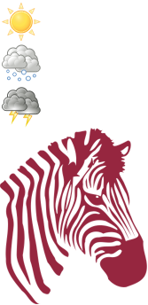
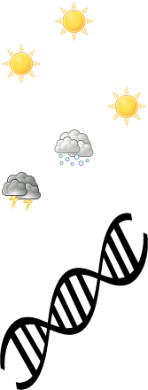

# svg-sprite

This file is part of the documentation of *svg-sprite* — a free low-level Node.js module that **takes a bunch of SVG files**, optimizes them and creates **SVG sprites** of several types. The package is [hosted on GitHub](https://github.com/svg-sprite/svg-sprite).


## Aligning and duplicating shapes

CSS sprites with `"vertical"` or `"horizontal"` layout use only one axis for positioning the shapes inside the sprite. For the opposite axis, *svg-sprite* uses `0` as the default positioning value. That's why the weather icons are left-aligned in the following example:



To use these icons as centered background images, you would need them to be centered within the sprite as well. This is where the **extended alignment options** jump in. To control the placement of the shapes, use the `shape.align` option to specify the path of a [YAML](https://yaml.org/) file with the following format:

```yaml
<shape-ID-or-path>:
  <template-string-with-placeholder>: <positioning>
```

* `<shape-ID-or-path>` has to be the **"local" file path part** or the final **shape ID / CSS class name** of a particular shape in your sprite. Use the `"*"` for a catch-all rule (needs to be quoted in the YAML file).
* `<template-string-with-placeholder>` is a powerful feature that lets you **derive displaced copies** of your shapes. [See below](#creating-displaced-shape-copies) for an example. The string should contain the placeholder `"%s"` which gets replaced by the ID of the matched shape. If the placeholder cannot be found in the string, it will be used as the suffix for the shape ID.
* `<positioning>` is a floating point value between `0` and `1`, expressing the relative placement of the shape on the secondary axis (0 - 100%).

*svg-sprite*'s default behavior can be expressed as follows:

```yaml
"*":
  "%s": 0
```

### Centering shapes

With only these two lines

```yaml
"*":
  "%s": .5
```

all the icons in the example sprite above get centered:


### Creating displaced shape copies

You can leverage the `<template-string-with-placeholder>` for creating displaced on-the-fly copies of your shapes:

```yaml
"*":
  "%s": .5

weather-clear:
  -left: 0
  -right: 1

weather-storm:
  "%s": 0
```

Remember that omitting the placeholder `"%s"`will make the template strings to be used as a suffices, effectively leading to the virtual shape IDs / CSS class names `"weather-clear-left"` and `"weather-clear-right"` (`"-left"` is equivalent to `"%s-left"`).



As the displaced copies are created with the `<use>` element, your sprite doesn't get significantly bigger in file size by duplicating shapes this way. For each of the duplicates, an **individual CSS rule** is created in the stylesheet resources, using the virtual shape ID as selector class name.
